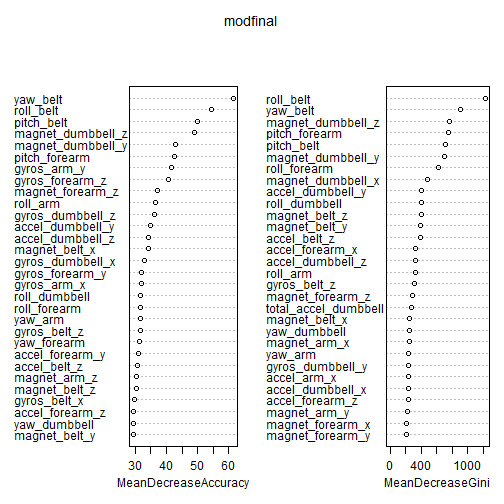

# Practical Machine Learning: Predictive Assignment

## Loading and preprocessing the data  
Load the data,  this data came from the study described at
```
http://groupware.les.inf.puc-rio.br/har
```

```r
pml.training <- read.csv("~/Classes/MOOC/Johns Hopkins Course Materials/Practical Machine Learning/Prediction Assignment/pml-training.csv")
pml.testing <- read.csv("~/Classes/MOOC/Johns Hopkins Course Materials/Practical Machine Learning/Prediction Assignment/pml-testing.csv")
```
Many of the variables are empty or have an excessive number of missing values, we will remove them first.


```r
names(pml.training)[apply(is.na(pml.training),2,sum)>100]
```

```
##  [1] "max_roll_belt"            "max_picth_belt"          
##  [3] "min_roll_belt"            "min_pitch_belt"          
##  [5] "amplitude_roll_belt"      "amplitude_pitch_belt"    
##  [7] "var_total_accel_belt"     "avg_roll_belt"           
##  [9] "stddev_roll_belt"         "var_roll_belt"           
## [11] "avg_pitch_belt"           "stddev_pitch_belt"       
## [13] "var_pitch_belt"           "avg_yaw_belt"            
## [15] "stddev_yaw_belt"          "var_yaw_belt"            
## [17] "var_accel_arm"            "avg_roll_arm"            
## [19] "stddev_roll_arm"          "var_roll_arm"            
## [21] "avg_pitch_arm"            "stddev_pitch_arm"        
## [23] "var_pitch_arm"            "avg_yaw_arm"             
## [25] "stddev_yaw_arm"           "var_yaw_arm"             
## [27] "max_roll_arm"             "max_picth_arm"           
## [29] "max_yaw_arm"              "min_roll_arm"            
## [31] "min_pitch_arm"            "min_yaw_arm"             
## [33] "amplitude_roll_arm"       "amplitude_pitch_arm"     
## [35] "amplitude_yaw_arm"        "max_roll_dumbbell"       
## [37] "max_picth_dumbbell"       "min_roll_dumbbell"       
## [39] "min_pitch_dumbbell"       "amplitude_roll_dumbbell" 
## [41] "amplitude_pitch_dumbbell" "var_accel_dumbbell"      
## [43] "avg_roll_dumbbell"        "stddev_roll_dumbbell"    
## [45] "var_roll_dumbbell"        "avg_pitch_dumbbell"      
## [47] "stddev_pitch_dumbbell"    "var_pitch_dumbbell"      
## [49] "avg_yaw_dumbbell"         "stddev_yaw_dumbbell"     
## [51] "var_yaw_dumbbell"         "max_roll_forearm"        
## [53] "max_picth_forearm"        "min_roll_forearm"        
## [55] "min_pitch_forearm"        "amplitude_roll_forearm"  
## [57] "amplitude_pitch_forearm"  "var_accel_forearm"       
## [59] "avg_roll_forearm"         "stddev_roll_forearm"     
## [61] "var_roll_forearm"         "avg_pitch_forearm"       
## [63] "stddev_pitch_forearm"     "var_pitch_forearm"       
## [65] "avg_yaw_forearm"          "stddev_yaw_forearm"      
## [67] "var_yaw_forearm"
```

```r
trainpml<-pml.training[,names(pml.training)%in%names(pml.training)[apply(is.na(pml.training),2,sum)<100]]
testpml<-pml.testing[,names(pml.training)%in%names(pml.training)[apply(is.na(pml.training),2,sum)<100]]
table(trainpml$classe,trainpml$user_name)
```

```
##    
##     adelmo carlitos charles eurico jeremy pedro
##   A   1165      834     899    865   1177   640
##   B    776      690     745    592    489   505
##   C    750      493     539    489    652   499
##   D    515      486     642    582    522   469
##   E    686      609     711    542    562   497
```
It appears that each class is about the same size, A tends to be a bit larger, and each user equally represented.  

Now looking at the data, it appears that the training data has summary numbers such as ```max_roll_belt``` that are not in the testing data set.  We will remove them as well as the time stamps.


```r
names(trainpml)[c(1,3,4,5,6,7,12,13,14,15,16,17,18,19,20,43,44,45,46,47,48,52,53,54,55,56,57,58,59,60,74,75,76,77,78,79,80,81,82)]
```

```
##  [1] "X"                       "raw_timestamp_part_1"   
##  [3] "raw_timestamp_part_2"    "cvtd_timestamp"         
##  [5] "new_window"              "num_window"             
##  [7] "kurtosis_roll_belt"      "kurtosis_picth_belt"    
##  [9] "kurtosis_yaw_belt"       "skewness_roll_belt"     
## [11] "skewness_roll_belt.1"    "skewness_yaw_belt"      
## [13] "max_yaw_belt"            "min_yaw_belt"           
## [15] "amplitude_yaw_belt"      "kurtosis_roll_arm"      
## [17] "kurtosis_picth_arm"      "kurtosis_yaw_arm"       
## [19] "skewness_roll_arm"       "skewness_pitch_arm"     
## [21] "skewness_yaw_arm"        "kurtosis_roll_dumbbell" 
## [23] "kurtosis_picth_dumbbell" "kurtosis_yaw_dumbbell"  
## [25] "skewness_roll_dumbbell"  "skewness_pitch_dumbbell"
## [27] "skewness_yaw_dumbbell"   "max_yaw_dumbbell"       
## [29] "min_yaw_dumbbell"        "amplitude_yaw_dumbbell" 
## [31] "kurtosis_roll_forearm"   "kurtosis_picth_forearm" 
## [33] "kurtosis_yaw_forearm"    "skewness_roll_forearm"  
## [35] "skewness_pitch_forearm"  "skewness_yaw_forearm"   
## [37] "max_yaw_forearm"         "min_yaw_forearm"        
## [39] "amplitude_yaw_forearm"
```

```r
trainpml<-trainpml[,-c(1,3,4,5,6,7,12,13,14,15,16,17,18,19,20,43,44,45,46,47,48,52,53,54,55,56,57,58,59,60,74,75,76,77,78,79,80,81,82)]
testpml<-testpml[,-c(1,3,4,5,6,7,12,13,14,15,16,17,18,19,20,43,44,45,46,47,48,52,53,54,55,56,57,58,59,60,74,75,76,77,78,79,80,81,82)]
```
Some of the variables do not have a great deal of variation, such as the ones with total acceleration, but I will leave them in the model.  I suspect they will not be important predictors.  

## Cross-validation for an estimate of error   
We will now create 5 folds for cross-validation and then run a random forest model.

```r
library(randomForest)
set.seed(1001)
folds=sample(1:5,nrow(trainpml),replace=TRUE)
length(folds)
```

```
## [1] 19622
```

```r
table(folds)
```

```
## folds
##    1    2    3    4    5 
## 3967 3874 4000 3857 3924
```
Now building the model and estimating error rate using cross-validation.


```r
set.seed(3829)
cv.error=rep(NA,5)
for (i in 1:5){
  modtemp<-randomForest(classe~.,data=trainpml[folds!=i,])
  predtemp<-predict(modtemp,newdata=trainpml[folds==i,])
  cv.error[i]<-1-sum(diag(table(predtemp,trainpml$classe[folds==i])))/length(predtemp)
}
cv.error
```

```
## [1] 0.003277 0.005421 0.005500 0.004148 0.003313
```
Based on cross-validation, the estimate for the out of sample error is .43%.  

## Building the model and predicting test data
Finally we will build a model on all the training data and then use it to predict the test data.


```r
modfinal<-randomForest(classe~.,data=trainpml,importance=TRUE)
modfinal
```

```
## 
## Call:
##  randomForest(formula = classe ~ ., data = trainpml, importance = TRUE) 
##                Type of random forest: classification
##                      Number of trees: 500
## No. of variables tried at each split: 7
## 
##         OOB estimate of  error rate: 0.27%
## Confusion matrix:
##      A    B    C    D    E class.error
## A 5579    1    0    0    0   0.0001792
## B   11 3782    4    0    0   0.0039505
## C    0   11 3410    1    0   0.0035067
## D    0    0   18 3196    2   0.0062189
## E    0    0    0    5 3602   0.0013862
```
Notice that the out of bag estimate of error, .27%, is a little optimistic relative to the cross-validated error, .43%.  

A plot of the importance of variables gives you some idea of which variables are important predictors.  


```r
varImpPlot(modfinal)
```

 

Finally we will predict the class of the 20 testing observations.  


```r
predfinal<-predict(modfinal,newdata=testpml)
predfinal
```

```
##  1  2  3  4  5  6  7  8  9 10 11 12 13 14 15 16 17 18 19 20 
##  B  A  B  A  A  E  D  B  A  A  B  C  B  A  E  E  A  B  B  B 
## Levels: A B C D E
```

This concludes the project.  


